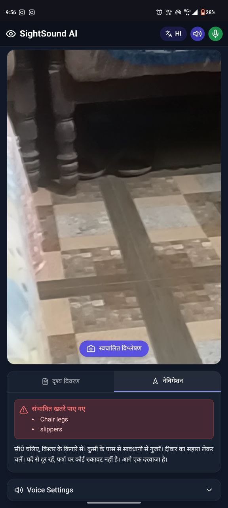
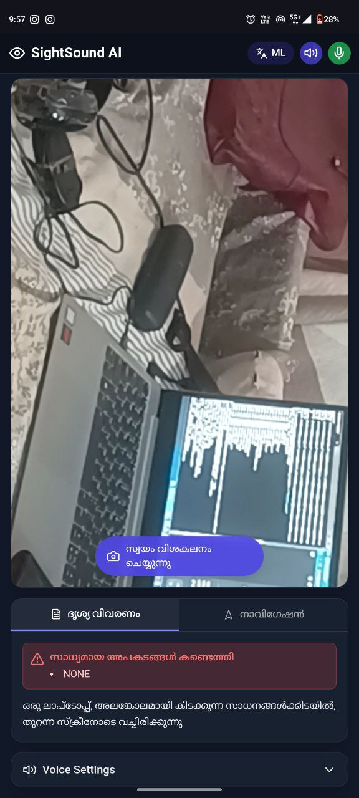

# SightSound AI 👁️🔊

A multilingual AI-powered assistant that helps visually impaired individuals understand their surroundings through real-time scene description and navigation guidance.

## Features 🌟

- **Real-time Scene Analysis**: Continuously analyzes the environment using advanced AI to describe scenes and identify objects
- **Navigation Assistance**: Provides clear directional guidance and obstacle warnings
- **Hazard Detection**: Automatically identifies and warns about potential dangers in the environment
- **Multilingual Support**:
  - English (en)
  - Hindi (hi)
  - Malayalam (ml)
- **Voice Control**: Hands-free operation through voice commands
- **Customizable Voice Settings**:
  - Adjustable speech rate and pitch
  - Multiple voice options
  - Default Google Hindi voice for optimal multilingual support
- **Mobile Responsive**: Fully functional on both desktop and mobile devices

## Voice Commands 🎤

- "Switch to navigation" / "नेविगेशन" / "നാവിഗേഷൻ"
- "Switch to scene" / "दृश्य विवरण" / "ദൃശ്യ വിവരണം"
- "Hazards" / "खतरे" / "അപകടങ്ങൾ"
- "Switch language" / "भाषा बदलें" / "ഭാഷ മാറ്റുക"

## Technology Stack 💻

- React 18
- TypeScript
- Vite
- Tailwind CSS
- Google's Gemini AI
- Web Speech API
- React Webcam
- Lucide React Icons

## Getting Started 🚀

### Prerequisites

- Node.js 18 or higher
- npm or yarn

### Installation

1. Clone the repository:

   ```bash
   git clone https://github.com/abhinavrnarayan/SightSoundAI-ARN.git
   ```

2. Navigate to the project directory:

   ```bash
   cd SightSoundAI-ARN
   ```

3. Install dependencies:

   ```bash
   npm install
   ```

4. Start the development server:

   ```bash
   npm run dev
   ```

5. Open your browser and navigate to the provided local URL

### Building for Production

```bash
npm run build
```

## Browser Compatibility 🌐

For the best experience, use:

- Google Chrome (recommended)
- Microsoft Edge
- Safari

Requires:

- Camera access
- Microphone access
- JavaScript enabled
- Web Speech API support

## OUTPUT





## Privacy and Security 🔒

- All image processing is done in real-time
- No images or audio are stored
- Camera and microphone access required only while using the application

## Contributing 🤝

Contributions are welcome! Please feel free to submit a Pull Request.

## License 📄

This project is licensed under the MIT License - see the [LICENSE](LICENSE) file for details.

## Acknowledgments 🙏

- Google Gemini AI for powering the visual analysis
- The React and TypeScript communities
- All contributors and users of this application
